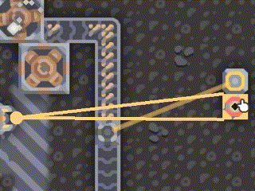

# Mindustry Simple-Powers MOD
A Mindutry MOD provides simple rustly ways to get powers.

# Content

## Step Generator

This floor generates powers by tapping, clicking.
And, When ground units walk in this floor, it generates powers too.

## Hand Pump

A manual pump that does not require Metaglass.
You have to tap/click to pump up.

## Disposable Battery

Primary-Cell battery that cannot be recharged.
It can be used as an emergency power source.

